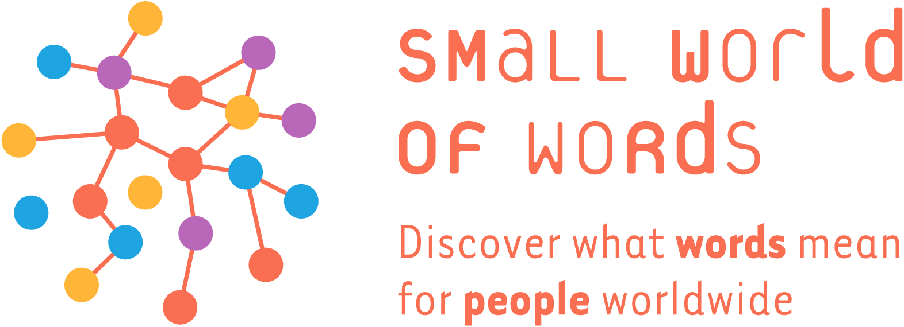
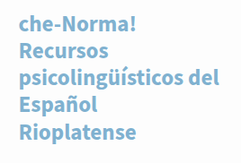

Charlas, conferencias y presentaciones.

<!--
  Imagen: siempre con  al inicio del bloque
  (así Quarto copia el archivo; no uses url() en CSS).

  Miniatura (default): ::: {.charla-card}
  Fondo:              ::: {.charla-card .charla-card-bg}
-->

:::: {.charlas-grid}

::: {.charla-card}
{fig-alt="Gráfico del Small World of Words"}

### Título de la charla

::: {.charla-meta}
2024 · Congreso / evento · Montevideo
:::

Una línea breve sobre de qué se trató.

::: {.charla-links}
[Slides](#){target="_blank"} · [Video](#){target="_blank"}
:::
:::

::: {.charla-card .charla-card-bg}
{fig-alt="Chenorma"}

### Charla con imagen de fondo

::: {.charla-meta}
2023 · Seminario · Udelar
:::

El texto va sobre un degradé oscuro para que se lea bien.

::: {.charla-links}
[PDF](#){target="_blank"}
:::
:::

::: {.charla-card}
### Sin imagen

::: {.charla-meta}
2022 · Workshop
:::

También se puede dejar la tarjeta solo con texto.
:::

::::
