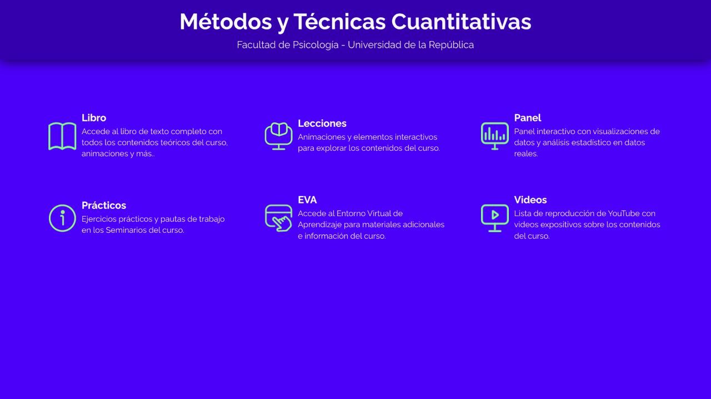

:::: {.charlas-grid}

::: {.charla-card}

### Small World of Words

::: {.charla-meta}
Normas de asociación libre
:::

Proyecto liderado por Simon de Deyne, busca colectar normas de asociación libre a gran escala en varios idiomas. Nuestra contribución principal es la __Norma de asociación libre para el español rioplatense__, así como estudios que usan estos datos para detectar cambios rápidos en el significado de las palabras causados por la pandemia de COVID-19, entre otros.

::: {.charla-links}
[Jugar!](https://smallworldofwords.org/es-UY) · [Conocé los resultados](swow-resultados.qmd) · [Más info](https://smallworldofwords.org/es-UY/project)
:::
:::

::: {.charla-card}

[{.cuanti-card-image}](cuanti.qmd)

### Cuanti

::: {.charla-meta}
Enseñanza de métodos cuantitativos en Psicología
:::

Proyecto docente de la Facultad de Psicología que combina aula invertida, seminarios y recursos web abiertos para enseñar estadística con problemas y datos concretos. Reúne un libro, lecciones interactivas, un panel de análisis y materiales prácticos.

::: {.charla-links}
[Conocé el proyecto](cuanti.qmd) · [Explorá los recursos](https://cuanti.psico.edu.uy)
:::
:::

::::  
